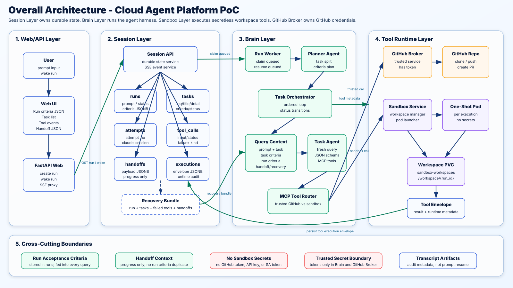
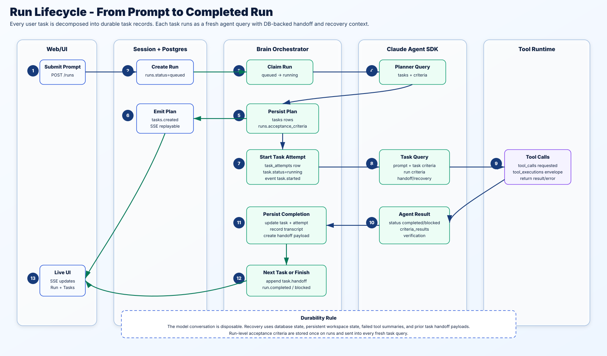
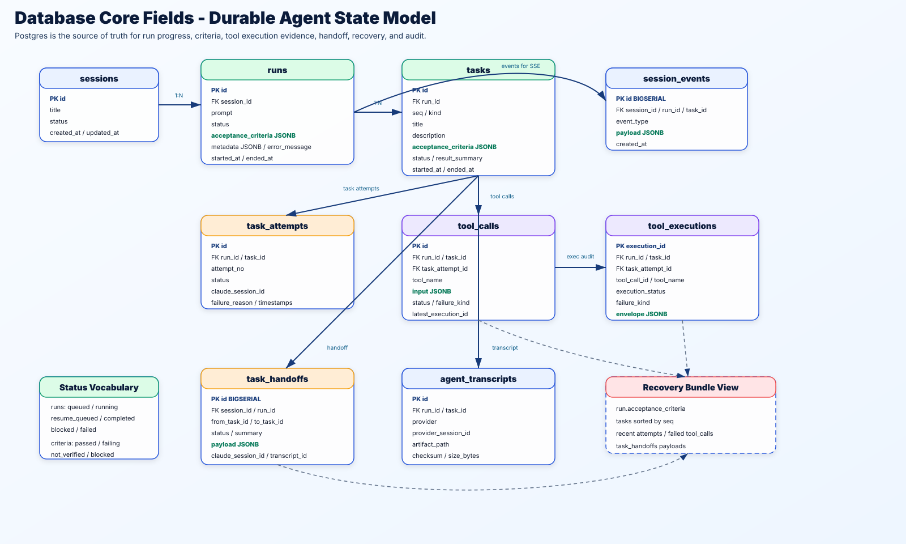
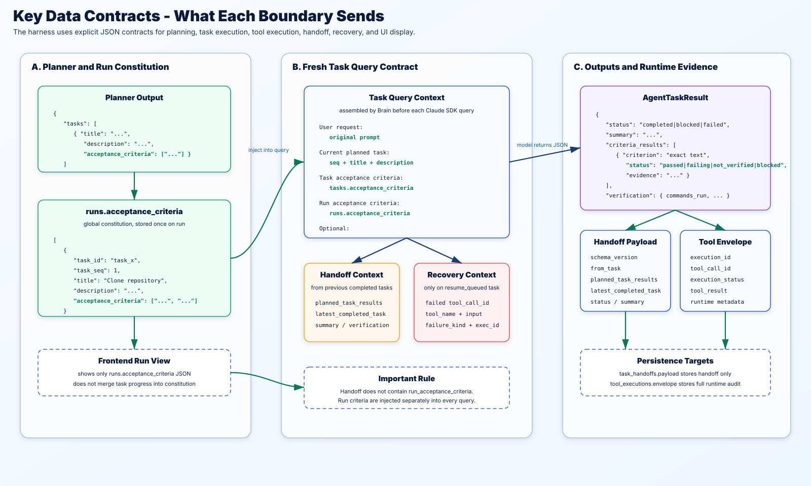
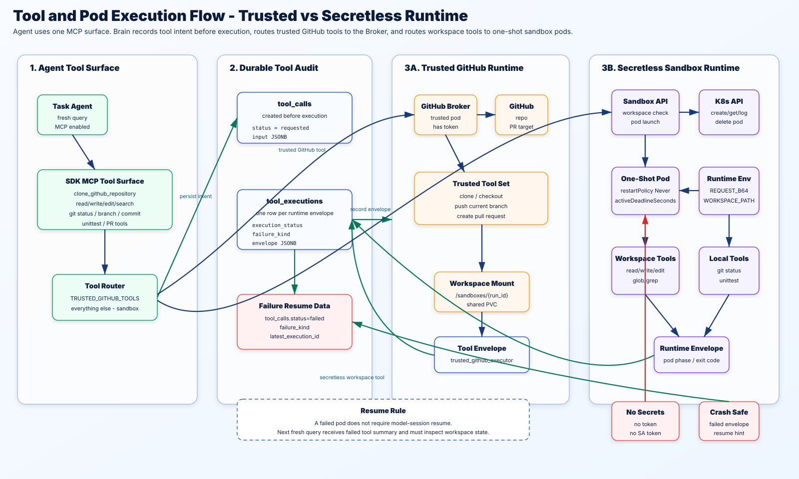

# Architecture Diagrams

These SVG diagrams document the current Cloud Agent Platform PoC architecture.
They are intended for architecture review, implementation orientation, and
system design discussion.

## 1. Overall Architecture

End-to-end layered architecture: Web/API, Session/Postgres, Brain/Agent Harness,
Tool Runtime, and security/recovery boundaries.

[Open SVG](overall-architecture.svg)

## 2. Run Flow

The lifecycle from browser prompt to queued run, planner output, task attempts,
tool calls, handoff persistence, and final run completion.

[Open SVG](run-flow.svg)

## 3. Database Core Fields

Durable state model and key fields for sessions, runs, tasks, attempts, tool
calls, tool executions, handoffs, transcripts, and recovery bundles.

[Open SVG](database-core-fields.svg)

## 4. Data Contracts

The JSON contracts crossing major boundaries: planner output, run acceptance
criteria, task query context, handoff payload, tool envelope, and agent task
result.

[Open SVG](data-contracts.svg)

## 5. Tool and Pod Flow

How a single MCP tool surface routes calls to either the trusted GitHub Broker
or secretless one-shot sandbox Pods, while recording tool call intent and runtime
envelopes.

[Open SVG](tool-pod-flow.svg)
